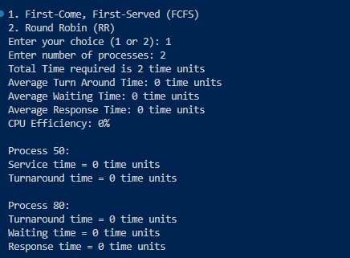

# CPU Scheduling Algorithms Comparison Simulator

## Overview
This project contains a CPU scheduling simulation project implemented in C++. The project aims to compare the performance of two CPU scheduling algorithms: Shortest Job First (SJF) and Shortest Remaining Time Next (SRTN). The simulator executes a set of processes with CPU requirements and collects various statistics to evaluate the efficiency of each algorithm.

## Features

- **FCFS Algorithm**: Simulates the FCFS scheduling algorithm.
- **Round Robin Algorithm**: Simulates the Round Robin scheduling algorithm with a specified time quantum.
- **Performance Metrics**: Calculates and displays average turnaround time, waiting time, response time, and CPU efficiency.
- **Input**: Processes are read from an input file (`input.txt`) with each line containing process ID, arrival time, and burst time.
- **Output**: Provides detailed results for each process and overall performance metrics.
  
## Code Snippets
Round Robin Scheduling Algorithm Implementation
The Round Robin (RR) scheduling algorithm is implemented in the roundRobin function. This function is responsible for simulating the Round Robin scheduling policy, where each process is assigned a fixed time quantum for execution.

Here's how the roundRobin function was implemented:
   ```cpp
   void roundRobin(vector<Process>& processes, int quantum) {
    queue<int> readyQueue; // Queue to store the indexes of ready processes
    int currentTime = 0;   // Current time in the simulation
    int remainingTime[processes.size()]; // Array to track remaining burst time for each process

    // Initialize remainingTime array with burst times of each process
    for (int i = 0; i < processes.size(); ++i) {
        remainingTime[i] = processes[i].burstTime;
    }

    int index = 0; // Index to iterate through processes

    while (true) {
        bool done = true; // Flag to check if all processes are executed

        // Traverse through each process
        for (int i = 0; i < processes.size(); ++i) {
            // If the process has remaining burst time
            if (remainingTime[i] > 0) {
                done = false; // There are still processes left to execute

                // Execute the process for the quantum or its remaining time, whichever is smaller
                int executeTime = min(quantum, remainingTime[i]);
                currentTime += executeTime;
                remainingTime[i] -= executeTime;

                // Check if the process is completed
                if (remainingTime[i] == 0) {
                    processes[i].completionTime = currentTime; // Set completion time
                }

                // Add the index of the process to the ready queue
                readyQueue.push(i);
            }
        }

        // If all processes are executed, exit the loop
        if (done) {
            break;
        }

        // Move to the next process in the ready queue
        index = (index + 1) % processes.size();

        // Skip idle time
        if (remainingTime[index] == 0) {
            continue;
        }

        // Execute the process at the front of the ready queue
        while (!readyQueue.empty() && remainingTime[index] == 0) {
            index = (index + 1) % processes.size();
        }
    }
}
<details>
<summary>Explanation</summary>

- The `roundRobin` function iterates through each process in a round-robin manner, executing them for a fixed time quantum.
- It maintains a queue to keep track of processes ready for execution and updates the completion time for each process.
- This implementation is crucial for evaluating the performance of the Round Robin scheduling algorithm within the CPU scheduling simulation project.

</details>


   ```

## Getting Started

1. **Clone the Repository**: Clone this repository to your local machine.

   ```bash
   git clone https://github.com/Hackerdude374/ProcessPilot.git

2. **Navigate to Project Directory**: Move into the project directory.

   ```bash
   cd ProcessPilot

3. **Compile the Code /Run the Simulator**: Compile the C++ code using a C++ compiler. For example, using g++:

   ```bash
   g++ -o main main.cpp
   ```
   then run
   ```bash
   ./main
   ```

4. Pick your Scheduling Algorithm and Number of Processes.


5. Enjoy!

